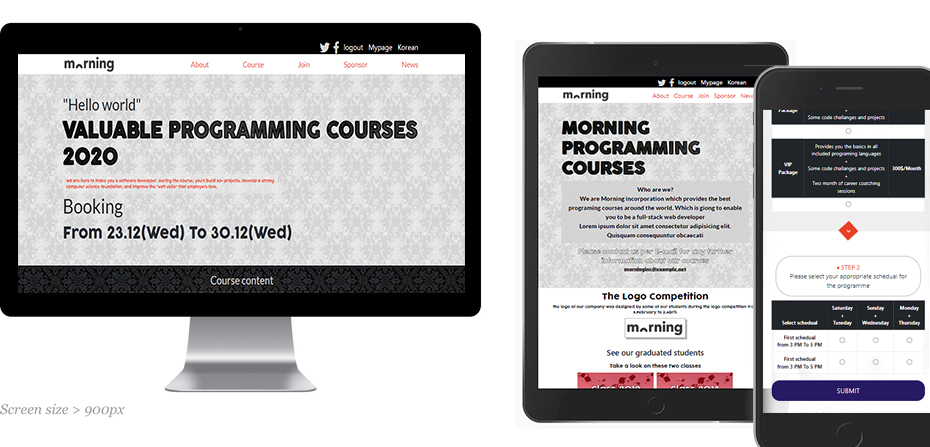

<h1 align="center">
Project Name: Morning Programming Courses
</h1>
<h2 align="center">
About:
</h2>

-My First Solo Project at Microverse. 
-Built as a responsive three pages linked to each other: 

    1-Home page. 
    2-About page. 
    3-Booking Page "join". 

## Built With

- HTML.
- CSS.
- Bootstrap.
-FontAwesome icons.
-Google Fonts.

<h2 align="center">
How to clone and use:
</h2>

    1- Open your terminal.
    2- Paste "git clone https://github.com/GuNner-pete/Capstone-project.git" in the terminal.
    3- cd Capstone-project
    4- Open index.html
    5- Congratulations, now you got the data!

<h1 align="center">
Live Demo 
    https://gunner-pete.github.io/Capstone-project/
</h1>
<h1>
  :notebook_with_decorative_cover: Acknowledgment:
</h1>

# The original design of this page was made by [Cindy Shin](https://www.behance.net/adagio07)

<h1 align="center">
Peter Mo Gerges
</h1>
<h2 align="center">
Find Me Arround web:
</h2>

<h2 align="center">
Show your support
</h2>

Give a ⭐️ if you like this project!

<h2 align="center">
📝 License
</h2>
<h3 align="center">
This project is [MIT](https://github.com/GuNner-pete/MIT-License/blob/main/README.md) licensed.
</h3>
